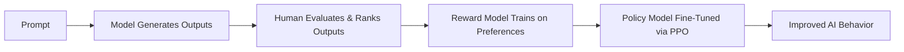

Excellent — continuing your **AI Engineer 2025 roadmap**, here’s the next one 👇

---

# 🧍‍♂️ Lesson 72 — Human-in-the-Loop AI Systems

### *AI Engineer Roadmap 2025 — Skill #72*

---

## 🎯 Objective

Learn how to design **AI systems that collaborate with humans**, integrating expert feedback, supervision, and decision control — essential for **safe, adaptive, and explainable** real-world applications.

---

## 🧩 Definition

**Human-in-the-Loop (HITL)** systems combine the strengths of **machine efficiency** and **human judgment**.
Instead of full automation, the model continuously learns and improves from human feedback — forming the foundation for **reinforcement learning from human feedback (RLHF)** and **AI safety alignment**.

---

## 🧠 Core Concepts

| Concept                                      | Description                                                                      |
| -------------------------------------------- | -------------------------------------------------------------------------------- |
| **HITL Workflow**                            | Humans label, validate, and correct AI outputs iteratively.                      |
| **Active Learning**                          | Model selectively queries humans for uncertain samples.                          |
| **Feedback Loops**                           | Continuous improvement cycle between model predictions and user corrections.     |
| **Reinforcement from Human Feedback (RLHF)** | AI learns preferred behaviors through rated outputs.                             |
| **Annotation Interfaces**                    | Tools for human labeling (Label Studio, Prodigy, Amazon SageMaker Ground Truth). |
| **Confidence Thresholding**                  | Automatically escalate uncertain predictions to humans.                          |
| **Human Override**                           | Allows human decisions to override AI actions for accountability.                |
| **Trust Calibration**                        | Designing systems where users understand AI confidence levels.                   |

---

## ⚙️ Example — Active Learning with Uncertainty Sampling

```python
from modAL.models import ActiveLearner
from sklearn.ensemble import RandomForestClassifier
from sklearn.datasets import load_iris

X, y = load_iris(return_X_y=True)
learner = ActiveLearner(estimator=RandomForestClassifier(), X_training=X[:50], y_training=y[:50])

query_idx, query_inst = learner.query(X[50:])
# Human labels uncertain instance
human_label = y[query_idx]
learner.teach(X[query_idx], human_label)
```

➡️ Human annotates the **most uncertain samples** — improving the model efficiently.

---

## ⚙️ Example — RLHF Workflow (Conceptual)



➡️ Human preference data is used to fine-tune large models like GPT, Gemini, or Claude.

---

## 🧱 HITL Tools & Frameworks (2025 Landscape)

| Category                       | Tools / Frameworks                                             |
| ------------------------------ | -------------------------------------------------------------- |
| **Annotation & Labeling**      | Label Studio, Prodigy, Scale AI, Amazon SageMaker Ground Truth |
| **Feedback Collection**        | Streamlit Feedback Widgets, Gradio Interfaces                  |
| **RLHF Frameworks**            | Hugging Face TRL, OpenAI Trainer, DeepSpeed-Chat               |
| **Active Learning**            | modAL, Snorkel, Lightly                                        |
| **Human Oversight Dashboards** | Arize, Weights & Biases, WhyLabs                               |

---

## 📘 Mini Project

**Goal:** Build a **HITL Text Moderation System**
**Steps:**

1. Train a toxicity classifier.
2. Display uncertain predictions to human reviewers.
3. Collect feedback and retrain model weekly.
4. Track improvement metrics (precision, recall).

**Expected Outcome:**
A system that learns safely from human corrections — increasing reliability and reducing false positives over time.

---

## 🧠 Example Prompt

> “Why is a Human-in-the-Loop system more reliable for high-risk domains like healthcare or finance?”

---

## 🔍 Key Takeaway

HITL systems keep **humans in charge**, not out of the loop — blending human intuition with AI automation for **safe, evolving intelligence**.

---

## 📚 Further Reading

* [HITL Machine Learning (Google Research)](https://research.google/pubs/human-in-the-loop-ml/)
* [OpenAI RLHF Overview](https://openai.com/research/learning-from-human-feedback)
* [Label Studio Documentation](https://labelstud.io/)
* [Active Learning with modAL](https://modal-python.readthedocs.io/)
* [Snorkel AI Weak Supervision](https://snorkel.ai/)
* [DeepSpeed-Chat for RLHF](https://github.com/microsoft/DeepSpeedExamples/tree/master/applications/DeepSpeed-Chat)

---

Would you like me to continue with **Lesson 73 — Reinforcement Learning Basics (RL, Q-Learning, Policy Gradients)** next — same 1-page markdown format?
