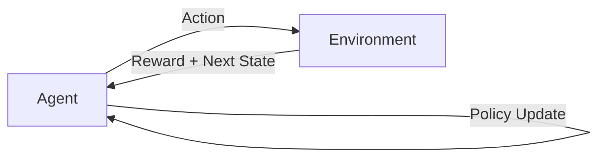

Excellent — continuing your **AI Engineer 2025 roadmap**, here’s the next one 👇

---

# 🎮 Lesson 73 — Reinforcement Learning Basics

### *(RL, Q-Learning, Policy Gradients, Reward Systems)*

### *AI Engineer Roadmap 2025 — Skill #73*

---

## 🎯 Objective

Understand the **core principles of Reinforcement Learning (RL)** — where agents learn to make decisions by interacting with environments, receiving **rewards** or **penalties**, and improving through trial and error.

This forms the foundation for **game-playing AI, robotics, and adaptive control systems**.

---

## 🧩 Definition

**Reinforcement Learning (RL)** is a branch of machine learning where an **agent** learns to achieve a goal by performing actions in an **environment** and receiving **feedback signals (rewards)**.

The goal: **maximize cumulative reward** over time.

---

## 🧠 Core Concepts

| Concept                         | Description                                            |
| ------------------------------- | ------------------------------------------------------ |
| **Agent**                       | The learner or decision-maker (e.g., robot, AI bot).   |
| **Environment**                 | The world the agent interacts with.                    |
| **State (s)**                   | A snapshot of the environment at a given time.         |
| **Action (a)**                  | A move or decision taken by the agent.                 |
| **Reward (r)**                  | Feedback signal after taking an action.                |
| **Policy (π)**                  | Strategy that maps states to actions.                  |
| **Value Function (V)**          | Expected cumulative reward from a state.               |
| **Q-Function (Q(s, a))**        | Expected reward of taking action *a* in state *s*.     |
| **Exploration vs Exploitation** | Balancing trying new actions vs using known good ones. |

---

## ⚙️ Example — Q-Learning Algorithm (Simplified)

```python
import numpy as np
Q = np.zeros((state_space, action_space))
for episode in range(1000):
    state = env.reset()
    done = False
    while not done:
        action = np.argmax(Q[state, :] + np.random.randn(1, action_space) * 0.1)
        next_state, reward, done, _ = env.step(action)
        Q[state, action] = Q[state, action] + 0.1 * (
            reward + 0.9 * np.max(Q[next_state, :]) - Q[state, action]
        )
        state = next_state
```

➡ The agent learns an optimal **Q-table** through repeated exploration and reward feedback.

---

## ⚙️ Example — RL Feedback Loop



➡ The agent continuously improves by observing outcomes and refining its policy.

---

## 🧱 RL Ecosystem (2025 Essentials)

| Tool / Library                    | Purpose                                     | Notes                            |
| --------------------------------- | ------------------------------------------- | -------------------------------- |
| **OpenAI Gym / Gymnasium**        | Benchmark environments for RL               | e.g., CartPole, MountainCar      |
| **Stable-Baselines3**             | Prebuilt RL algorithms (DQN, PPO, A2C, SAC) | Easy to integrate                |
| **RLlib (Ray)**                   | Scalable distributed RL training            | Production-grade                 |
| **PettingZoo**                    | Multi-agent RL environments                 | For collaboration or competition |
| **Unity ML-Agents**               | RL in simulated 3D worlds                   | Great for robotics & gaming      |
| **TensorFlow Agents (TF-Agents)** | Modular RL toolkit                          | TensorFlow ecosystem             |

---

## 📘 Mini Project

**Goal:** Train an agent to balance a pole using OpenAI Gym.

**Steps:**

1. Install `gymnasium` and `stable-baselines3`.
2. Choose environment: `CartPole-v1`.
3. Train an RL agent using DQN or PPO.
4. Visualize training rewards and agent performance.

**Expected Outcome:**
A trained agent capable of balancing the pole autonomously — demonstrating RL fundamentals in action.

---

## 🧠 Example Prompt

> “Using Stable-Baselines3, train a PPO agent to solve the CartPole environment and plot its reward curve.”

---

## 🔍 Key Takeaway

Reinforcement Learning turns **trial and error into intelligence**.
It’s the bridge between **AI prediction** and **AI action** — powering everything from **game champions to self-driving cars**.

---

## 📚 Further Reading

* [Sutton & Barto — *Reinforcement Learning: An Introduction*](http://incompleteideas.net/book/the-book-2nd.html)
* [OpenAI Gym Documentation](https://gymnasium.farama.org/)
* [Stable-Baselines3 GitHub](https://github.com/DLR-RM/stable-baselines3)
* [DeepMind’s DQN Paper (2015)](https://www.nature.com/articles/nature14236)
* [Unity ML-Agents Toolkit](https://unity.com/products/machine-learning-agents)

---

Would you like me to continue with **Lesson 74 — Deep Reinforcement Learning (RLHF, PPO, SAC)** next, same concise one-page format?
