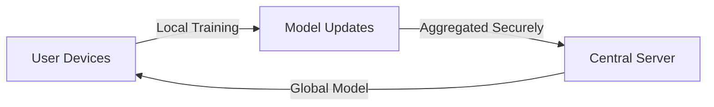

Excellent — continuing your **AI Engineer 2025 roadmap**, here’s the next one 👇

---

# 🔐 Lesson 78 — Privacy, Security & Data Protection

### *(GDPR, Differential Privacy, Federated Learning, Secure AI Pipelines)*

### *AI Engineer Roadmap 2025 — Skill #78*

---

## 🎯 Objective

Understand how to **protect user data and ensure privacy compliance** in AI systems using methods like **differential privacy**, **federated learning**, and **secure model deployment** — while aligning with global regulations such as **GDPR** and **CCPA**.

---

## 🧩 Definition

**Data Privacy in AI** means designing models and data pipelines that prevent exposure of personally identifiable information (PII) while still learning useful patterns.

It’s not just compliance — it’s about **building trust** and **reducing data risk** in every layer of your AI workflow.

---

## 🧠 Core Concepts

| Concept                                   | Description                                                                     |
| ----------------------------------------- | ------------------------------------------------------------------------------- |
| **GDPR / CCPA Compliance**                | Laws governing how personal data can be collected, processed, and stored.       |
| **Differential Privacy (DP)**             | Adds mathematical noise to data or gradients to protect individual information. |
| **Federated Learning (FL)**               | Training models across distributed devices without centralizing data.           |
| **Data Anonymization**                    | Removing or masking identifiers from datasets.                                  |
| **Secure Multi-Party Computation (SMPC)** | Enables collaborative computation without sharing raw data.                     |
| **Homomorphic Encryption**                | Allows models to compute on encrypted data without decryption.                  |
| **Access Control & Data Governance**      | Role-based restrictions and audit trails for sensitive data.                    |
| **Model Inversion / Membership Attacks**  | Adversarial techniques that extract private data from trained models.           |

---

## ⚙️ Example — Differential Privacy with TensorFlow

```python
from tensorflow_privacy.privacy.optimizers.dp_optimizer_keras import DPKerasSGDOptimizer
optimizer = DPKerasSGDOptimizer(
    l2_norm_clip=1.0,
    noise_multiplier=0.5,
    num_microbatches=256,
    learning_rate=0.15
)
model.compile(optimizer=optimizer, loss='categorical_crossentropy', metrics=['accuracy'])
```

➡ Adds controlled noise to gradients, protecting individual contributions.

---

## ⚙️ Example — Federated Learning Architecture



➡ Data **stays on-device**, while models improve collaboratively.

---

## 🧱 Privacy Tools & Ecosystem (2025 Overview)

| Tool / Library                             | Function                                   | Notes           |
| ------------------------------------------ | ------------------------------------------ | --------------- |
| **TensorFlow Privacy**                     | Differential privacy training              | Google Research |
| **PySyft (OpenMined)**                     | Federated & privacy-preserving learning    | Open-source     |
| **Flower (FLWR)**                          | Federated learning framework               | Python          |
| **FATE (WeBank)**                          | Enterprise federated learning platform     | Financial-grade |
| **Homomorphic Encryption Library (HElib)** | Compute on encrypted data                  | IBM Research    |
| **DP-SGD / Opacus**                        | Differentially private training in PyTorch | Meta AI         |
| **Presidio**                               | PII detection & anonymization              | Microsoft       |

---

## 📘 Mini Project

**Goal:** Build a **Federated Sentiment Model** with privacy guarantees.

**Steps:**

1. Simulate multiple clients (e.g., local text datasets).
2. Train models locally using Flower or PySyft.
3. Aggregate weights securely without centralizing data.
4. Evaluate accuracy vs privacy trade-offs.

**Expected Outcome:**
A proof-of-concept **federated learning pipeline** compliant with GDPR principles — no raw data leaves the device.

---

## 🧠 Example Prompt

> “Explain how differential privacy ensures individual anonymity in model training, and how it differs from data anonymization.”

---

## 🔍 Key Takeaway

AI privacy isn’t just technical — it’s **ethical, legal, and reputational**.
A truly secure AI system respects user autonomy and builds lasting trust by design.

---

## 📚 Further Reading

* [TensorFlow Privacy Documentation](https://github.com/tensorflow/privacy)
* [PySyft & OpenMined Tutorials](https://openmined.org/)
* [Flower Federated Learning](https://flower.dev/)
* [EU GDPR Regulation](https://gdpr.eu/)
* [NIST Privacy Framework](https://www.nist.gov/privacy-framework)
* [IBM Homomorphic Encryption Toolkit](https://github.com/IBM/helib)

---

Would you like me to continue with **Lesson 79 — Continuous Evaluation, Monitoring & Drift Detection** next, same one-page format?
