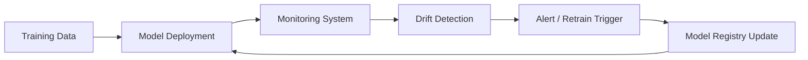

Excellent — continuing your **AI Engineer 2025 roadmap**, here’s the next one 👇

---

# 📈 Lesson 79 — Continuous Evaluation, Monitoring & Drift Detection

### *(MLOps, Model Drift, Performance Tracking, Real-Time Validation)*

### *AI Engineer Roadmap 2025 — Skill #79*

---

## 🎯 Objective

Learn how to **continuously monitor AI models after deployment** — detecting **data drift, concept drift, and performance degradation** in real time to ensure consistent, reliable, and ethical outputs over time.

This is how AI systems stay **trustworthy in production**, not just in the lab.

---

## 🧩 Definition

**Continuous Evaluation** means systematically testing deployed models against live data and benchmarks.
**Drift Detection** identifies changes in data patterns or relationships that degrade model accuracy.

Together, these form the foundation of **responsible, production-ready AI**.

---

## 🧠 Core Concepts

| Concept                         | Description                                                               |
| ------------------------------- | ------------------------------------------------------------------------- |
| **Data Drift**                  | Change in the statistical distribution of input features over time.       |
| **Concept Drift**               | Change in the relationship between inputs and outputs (e.g., new trends). |
| **Model Monitoring**            | Tracking predictions, latency, and reliability across environments.       |
| **Real-Time Validation**        | Comparing predictions to live ground truth or synthetic benchmarks.       |
| **Shadow Deployment**           | Running new models alongside old ones to compare live results safely.     |
| **Alerting & Thresholding**     | Triggering automatic retraining or human review when performance drops.   |
| **Model Registry & Versioning** | Managing different model versions and deployment metadata.                |
| **Ethical Monitoring**          | Watching for bias drift or fairness regressions over time.                |

---

## ⚙️ Example — Drift Detection with Evidently AI

```python
from evidently.report import Report
from evidently.metrics import DataDriftPreset

report = Report(metrics=[DataDriftPreset()])
report.run(reference_data=baseline_df, current_data=live_df)
report.show()
```

➡ Generates an interactive dashboard showing which features have drifted statistically.

---

## ⚙️ Example — MLOps Monitoring Flow



➡ A continuous cycle ensures model accuracy and stability in production.

---

## 🧱 Monitoring Tools & Ecosystem (2025 Overview)

| Tool / Platform            | Function                                               | Notes                                  |
| -------------------------- | ------------------------------------------------------ | -------------------------------------- |
| **Evidently AI**           | Drift & performance monitoring dashboards              | Open-source                            |
| **WhyLabs + WhyLogs**      | Real-time data logging and drift detection             | Scalable and cloud-ready               |
| **Prometheus + Grafana**   | Metric collection & visualization                      | MLOps infrastructure                   |
| **Arize AI**               | Observability for ML models (bias, drift, performance) | Enterprise                             |
| **Neptune.ai**             | Model experiment tracking                              | Lightweight integration                |
| **MLflow**                 | Model registry + performance tracking                  | Standardized across teams              |
| **Weights & Biases (W&B)** | Real-time experiment & metric tracking                 | Widely used in research and production |

---

## 📘 Mini Project

**Goal:** Build a **model monitoring dashboard** for an image classifier.

**Steps:**

1. Log predictions and metadata to a monitoring tool (Evidently or W&B).
2. Compare live vs training data distributions weekly.
3. Set up alerts when drift exceeds 10%.
4. Automate retraining pipeline if drift persists.

**Expected Outcome:**
A fully automated **model observability workflow** — keeping your AI system reliable, explainable, and continuously improving.

---

## 🧠 Example Prompt

> “How can you detect and mitigate concept drift in a deployed sentiment analysis model without halting production?”

---

## 🔍 Key Takeaway

AI systems don’t fail suddenly — they **decay silently**.
Continuous evaluation ensures your models stay **accurate, fair, and aligned** long after deployment.

---

## 📚 Further Reading

* [Evidently AI Docs](https://docs.evidentlyai.com/)
* [Arize AI Drift Monitoring](https://arize.com/)
* [WhyLabs Platform](https://whylabs.ai/)
* [MLflow Tracking and Registry](https://mlflow.org/)
* [W&B Monitoring Tools](https://wandb.ai/)
* [Google MLOps Framework](https://cloud.google.com/architecture/mlops-continuous-delivery-and-automation-pipelines-in-machine-learning)

---

Would you like me to continue with **Lesson 80 — Model Deployment, Scaling & Lifecycle Management** next, same 1-page markdown format?
