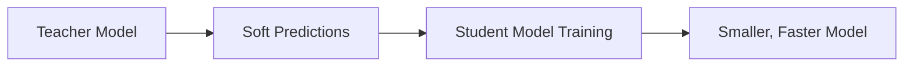

Excellent — continuing your **AI Engineer 2025 roadmap**, here’s the next one 👇

---

# ⚙️ Lesson 81 — Model Optimization, Compression & Quantization

### *(Pruning, Distillation, Quantization, Hardware Acceleration)*

### *AI Engineer Roadmap 2025 — Skill #81*

---

## 🎯 Objective

Learn how to **optimize AI models for speed, efficiency, and deployment** on edge devices, mobile platforms, or large-scale production systems — without significant loss in accuracy.

This is key for **scalable AI** that runs efficiently anywhere: from GPUs in the cloud to CPUs in smartphones.

---

## 🧩 Definition

**Model Optimization** involves techniques that reduce model size, latency, and computational cost.
**Compression** minimizes memory footprint, while **quantization** reduces numerical precision for faster inference.

Together, they make AI **lighter, faster, and cheaper** to deploy.

---

## 🧠 Core Concepts

| Concept                            | Description                                                                                      |
| ---------------------------------- | ------------------------------------------------------------------------------------------------ |
| **Model Pruning**                  | Removing redundant neurons, filters, or weights to shrink model size.                            |
| **Quantization**                   | Converting high-precision (FP32) weights to lower precision (e.g., INT8) for faster computation. |
| **Knowledge Distillation**         | Training a smaller “student” model to mimic a larger “teacher” model.                            |
| **Weight Clustering**              | Grouping similar weights to reduce storage requirements.                                         |
| **Dynamic vs Static Quantization** | Dynamic quantizes at inference; static precomputes scale factors during training.                |
| **Mixed Precision Training**       | Combines FP16 + FP32 operations for efficiency on GPUs.                                          |
| **Hardware Acceleration**          | Leveraging optimized hardware (TensorRT, ONNX Runtime, Core ML, etc.).                           |

---

## ⚙️ Example — Quantization with PyTorch

```python
import torch
from torchvision import models

model = models.resnet18(pretrained=True)
model.eval()

# Apply dynamic quantization
quantized_model = torch.quantization.quantize_dynamic(
    model, {torch.nn.Linear}, dtype=torch.qint8
)

print("Model size reduced by ~60%")
torch.save(quantized_model.state_dict(), "resnet18_quantized.pth")
```

➡ Reduces memory footprint and improves inference latency with minimal accuracy loss.

---

## ⚙️ Example — Knowledge Distillation Flow



➡ The smaller model learns from the teacher’s **probability distribution**, not just hard labels — improving generalization.

---

## 🧱 Optimization Tooling & Ecosystem (2025 Overview)

| Tool / Library                    | Function                                             | Notes                  |
| --------------------------------- | ---------------------------------------------------- | ---------------------- |
| **ONNX Runtime**                  | Cross-platform model optimization & inference engine | Microsoft              |
| **TensorRT**                      | GPU acceleration & quantization toolkit              | NVIDIA                 |
| **PyTorch FX / Torch-TensorRT**   | PyTorch-native optimization & compilation            | Open-source            |
| **TFLite (TensorFlow Lite)**      | Edge & mobile model deployment                       | Google                 |
| **OpenVINO**                      | Intel’s model optimization toolkit                   | Edge & CPU optimized   |
| **DeepSpeed / FasterTransformer** | Large model acceleration & memory optimization       | Microsoft & NVIDIA     |
| **BitsAndBytes (bnb)**            | 8-bit and 4-bit quantization for LLMs                | Hugging Face ecosystem |

---

## 📘 Mini Project

**Goal:** Optimize and deploy a vision model for mobile inference.

**Steps:**

1. Train or load a pre-trained CNN (e.g., ResNet).
2. Apply pruning and quantization with PyTorch or TFLite.
3. Benchmark inference time before and after.
4. Export to ONNX or Core ML format for mobile.

**Expected Outcome:**
A compressed, production-ready model running **2–4× faster** on limited hardware with minimal accuracy trade-offs.

---

## 🧠 Example Prompt

> “How do you apply post-training quantization to reduce a transformer model’s size while keeping BLEU score stable?”

---

## 🔍 Key Takeaway

The future of AI is **efficient AI**.
Through pruning, quantization, and distillation, you can transform massive models into **lightweight, deployable intelligence**.

---

## 📚 Further Reading

* [PyTorch Quantization Guide](https://pytorch.org/docs/stable/quantization.html)
* [TensorRT Optimization Toolkit](https://developer.nvidia.com/tensorrt)
* [ONNX Runtime Performance Docs](https://onnxruntime.ai/docs/performance/)
* [TensorFlow Lite Optimization Guide](https://www.tensorflow.org/lite/performance/post_training_quantization)
* [Hugging Face BitsAndBytes Integration](https://huggingface.co/docs/transformers/main_classes/quantization)
* [DeepSpeed Inference Documentation](https://www.deepspeed.ai/tutorials/inference-tutorial/)

---

Would you like me to continue with **Lesson 82 — Edge & On-Device AI (TinyML, Core ML, Edge TPU)** next, same 1-page format?
