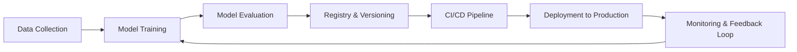

Excellent — continuing your **AI Engineer 2025 roadmap**, here’s the next one 👇

---

# 🧰 Lesson 85 — AI DevOps, CI/CD & Automation Pipelines for ML

### *(MLOps Automation, GitOps, CI/CD, Testing & Deployment Workflows)*

### *AI Engineer Roadmap 2025 — Skill #85*

---

## 🎯 Objective

Learn how to implement **continuous integration and continuous delivery (CI/CD)** for machine learning systems — automating everything from model training to deployment using **DevOps principles** tailored for AI workflows.

This ensures **fast iteration**, **reproducibility**, and **safe rollouts** in production AI systems.

---

## 🧩 Definition

**AI DevOps (MLOps)** brings DevOps automation into ML — managing the code, data, and models as versioned assets within automated build and deployment pipelines.

While DevOps automates *software updates*, MLOps automates *model lifecycle updates* — training, testing, validation, and redeployment.

---

## 🧠 Core Concepts

| Concept                                   | Description                                                                       |
| ----------------------------------------- | --------------------------------------------------------------------------------- |
| **CI (Continuous Integration)**           | Automatically testing and validating model and data changes.                      |
| **CD (Continuous Delivery / Deployment)** | Automatically packaging and deploying models once approved.                       |
| **GitOps**                                | Using Git as the single source of truth for ML infrastructure and model versions. |
| **Pipeline Orchestration**                | Coordinating multi-step ML workflows (training → testing → deployment).           |
| **Model Registry**                        | Tracks model versions, lineage, and promotion to production.                      |
| **Testing for ML**                        | Includes data validation, model validation, and integration tests.                |
| **Rollback & Canary Deployments**         | Gradual or reversible rollouts to ensure safety.                                  |
| **Infrastructure as Code (IaC)**          | Automating environment setup with Terraform, Helm, or CloudFormation.             |

---

## ⚙️ Example — GitHub Actions for ML Deployment

```yaml
name: ML CI/CD
on:
  push:
    branches: [ main ]
jobs:
  build-deploy:
    runs-on: ubuntu-latest
    steps:
      - name: Checkout repo
        uses: actions/checkout@v3
      - name: Set up Python
        uses: actions/setup-python@v4
        with:
          python-version: "3.10"
      - name: Install dependencies
        run: pip install -r requirements.txt
      - name: Run model tests
        run: pytest tests/
      - name: Deploy model
        run: bash deploy.sh
```

➡ A simple automated workflow that **tests, packages, and deploys** your ML model every time you push to `main`.

---

## ⚙️ Example — MLOps Flow



➡ A continuous **data → model → deploy → monitor** loop enables scalable, reliable AI delivery.

---

## 🧱 MLOps Tooling Stack (2025 Overview)

| Tool / Platform                            | Function                    | Notes                                |
| ------------------------------------------ | --------------------------- | ------------------------------------ |
| **GitHub Actions / GitLab CI / Jenkins**   | CI/CD automation            | Integrates with any ML stack         |
| **MLflow / Neptune / WandB**               | Model tracking & versioning | Experiment management                |
| **Kubeflow Pipelines / Airflow / Prefect** | Pipeline orchestration      | Production-grade workflow automation |
| **Docker / Kubernetes**                    | Deployment & scaling        | Core to reproducible environments    |
| **Terraform / Helm**                       | Infrastructure as Code      | Environment consistency              |
| **Argo CD / Flux**                         | GitOps for Kubernetes       | Declarative model deployment         |
| **DVC + CML**                              | Continuous machine learning | Automate model retraining in CI      |

---

## 📘 Mini Project

**Goal:** Build a **CI/CD pipeline for an image classification model.**

**Steps:**

1. Train a CNN and log results with MLflow.
2. Commit code to GitHub with model artifact tracking.
3. Create a CI workflow that runs tests on every commit.
4. Automatically deploy the latest passing model to an API (e.g., FastAPI on EC2).
5. Add monitoring and rollback triggers.

**Expected Outcome:**
An automated end-to-end **AI delivery pipeline** — from commit to production with zero manual steps.

---

## 🧠 Example Prompt

> “Describe how to integrate MLflow, GitHub Actions, and Docker for a fully automated CI/CD model pipeline.”

---

## 🔍 Key Takeaway

AI DevOps transforms ML from research experiments into **repeatable, production-grade systems**.
Automation brings speed, reliability, and governance — turning your AI workflow into a **continuous intelligence pipeline**.

---

## 📚 Further Reading

* [Google Cloud MLOps Guide](https://cloud.google.com/architecture/mlops-continuous-delivery-and-automation-pipelines-in-machine-learning)
* [MLflow CI/CD Documentation](https://mlflow.org/docs/latest/registry.html#ci-cd)
* [CML by Iterative.ai](https://cml.dev/)
* [GitHub Actions for ML](https://github.com/features/actions)
* [Kubeflow Pipelines Overview](https://www.kubeflow.org/docs/components/pipelines/)
* [Terraform Infrastructure for MLOps](https://developer.hashicorp.com/terraform/tutorials)

---

Would you like me to continue with **Lesson 86 — Cloud AI & Serverless Architectures (AWS, GCP, Azure, Lambda, Vertex AI)** next, same one-page markdown format?
