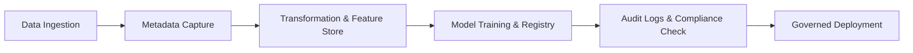

Excellent — continuing your **AI Engineer 2025 roadmap**, here’s the next one 👇

---

# 🧾 Lesson 87 — Data Governance, Lineage & Auditability

### *(Trustworthy AI Systems, Metadata Tracking, Compliance, Traceability)*

### *AI Engineer Roadmap 2025 — Skill #87*

---

## 🎯 Objective

Learn how to **govern, trace, and audit all data and model activities** in your AI pipeline — ensuring full **accountability, transparency, and regulatory compliance** across teams, datasets, and environments.

---

## 🧩 Definition

**Data Governance** defines policies, roles, and controls for managing data responsibly.
**Data Lineage** tracks *where data comes from, how it’s transformed, and where it goes*.
**Auditability** ensures every data or model decision can be **reconstructed, justified, and verified** — critical for high-stakes industries (finance, healthcare, government).

---

## 🧠 Core Concepts

| Concept                   | Description                                                     |
| ------------------------- | --------------------------------------------------------------- |
| **Data Catalogs**         | Central repositories for datasets, schemas, and metadata.       |
| **Lineage Graphs**        | Visual maps showing how data moves through systems.             |
| **Metadata Management**   | Stores dataset, feature, and model metadata for transparency.   |
| **Access Governance**     | Controls who can access or modify data/models.                  |
| **Audit Trails**          | Logs every modification for compliance and security.            |
| **Provenance Tracking**   | Links model outcomes back to original data sources.             |
| **Reproducibility**       | Ability to replicate experiments using versioned data and code. |
| **Compliance Frameworks** | Standards like GDPR, ISO/IEC 42001, and SOC 2.                  |

---

## ⚙️ Example — Data Lineage Query (OpenLineage)

```python
from openlineage.client import OpenLineageClient

client = OpenLineageClient(url="http://localhost:5000")
lineage = client.get_lineage(run_id="12345")
print(lineage)
```

➡ Retrieves the full lineage of a dataset or model — including source, transformation, and output nodes.

---

## ⚙️ Example — Data Governance Flow



➡ Every step is logged and traceable — forming a **verifiable chain of custody** for AI assets.

---

## 🧱 Governance & Lineage Tooling (2025 Ecosystem)

| Tool / Platform                   | Function                               | Notes                               |
| --------------------------------- | -------------------------------------- | ----------------------------------- |
| **OpenLineage**                   | Open-source data lineage tracking      | Integrates with Airflow, dbt, Spark |
| **Amundsen / DataHub / Collibra** | Data catalogs & metadata governance    | Enterprise data visibility          |
| **MLflow / Neptune.ai**           | Model versioning and metadata tracking | Model-level governance              |
| **Great Expectations**            | Data validation & documentation        | Adds testable guarantees            |
| **Atlas (Apache)**                | Enterprise data governance             | Standard in financial institutions  |
| **Marquez**                       | Open metadata service for lineage      | Lightweight OpenLineage backend     |
| **Delta Lake / LakeFS**           | Dataset versioning with audit trails   | Git-like data management            |

---

## 📘 Mini Project

**Goal:** Build a **governed ML workflow** with lineage tracking.

**Steps:**

1. Create an ETL pipeline using Airflow + OpenLineage.
2. Store metadata and schema info in DataHub.
3. Track model experiments in MLflow.
4. Generate a lineage visualization linking dataset → model → API output.
5. Export an audit report (JSON/CSV) for compliance.

**Expected Outcome:**
A **traceable, compliant ML system** — every prediction can be tied back to its origin and transformation path.

---

## 🧠 Example Prompt

> “How can I implement full data lineage and model audit trails using Airflow, OpenLineage, and MLflow for compliance with the EU AI Act?”

---

## 🔍 Key Takeaway

**Transparency is power.**
Governance and lineage ensure your AI systems are **accountable, reproducible, and compliant** — the foundation of *trustworthy AI*.

---

## 📚 Further Reading

* [OpenLineage Documentation](https://openlineage.io/)
* [DataHub Metadata Platform](https://datahubproject.io/)
* [Apache Atlas Overview](https://atlas.apache.org/)
* [MLflow Tracking Server](https://mlflow.org/docs/latest/tracking.html)
* [EU AI Act on Traceability & Documentation](https://artificialintelligenceact.eu/)
* [ISO/IEC 42001: AI Management System Standard](https://www.iso.org/standard/81230.html)

---

Would you like me to continue with **Lesson 88 — AI Observability & Telemetry (Logging, Metrics, Tracing for ML Systems)** next, same one-page markdown format?
