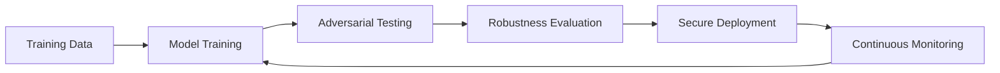

Excellent — continuing your **AI Engineer 2025 roadmap**, here’s the next one 👇

---

# 🧱 Lesson 89 — AI Security & Adversarial Robustness

### *(Model Attacks, Data Poisoning, Adversarial Defense, Secure ML)*

### *AI Engineer Roadmap 2025 — Skill #89*

---

## 🎯 Objective

Learn how to **defend AI systems from adversarial attacks, data poisoning, and model theft**, ensuring your ML applications are **resilient, trustworthy, and secure** under hostile conditions.

Security in AI isn’t optional — it’s mission-critical.

---

## 🧩 Definition

**AI Security** protects models, data, and pipelines from malicious manipulation or exploitation.
**Adversarial Robustness** focuses on defending against *intentionally crafted inputs* that cause the model to make wrong predictions.

Together, they ensure your AI systems remain **safe, private, and dependable**, even when under attack.

---

## 🧠 Core Concepts

| Concept                     | Description                                                                        |
| --------------------------- | ---------------------------------------------------------------------------------- |
| **Adversarial Examples**    | Slightly altered inputs designed to fool models (e.g., pixel-level perturbations). |
| **Data Poisoning**          | Attackers inject malicious data into training sets to bias model outcomes.         |
| **Model Inversion**         | Infers sensitive information about the training data from model outputs.           |
| **Model Stealing**          | Replicating a model’s behavior by querying it extensively.                         |
| **Membership Inference**    | Determines whether a particular record was used during training.                   |
| **Evasion Attacks**         | Adversarial inputs crafted to bypass detection systems.                            |
| **Robust Training**         | Training models on perturbed data to improve resistance.                           |
| **Secure Model Deployment** | Encrypting models and APIs to prevent theft or tampering.                          |

---

## ⚙️ Example — Generating Adversarial Samples (FGSM Attack)

```python
import torch
import torch.nn.functional as F

def fgsm_attack(model, data, labels, epsilon):
    data.requires_grad = True
    outputs = model(data)
    loss = F.nll_loss(outputs, labels)
    model.zero_grad()
    loss.backward()
    data_grad = data.grad.data
    perturbed = data + epsilon * data_grad.sign()
    return torch.clamp(perturbed, 0, 1)
```

➡ Creates adversarially perturbed images to test model robustness.

---

## ⚙️ Example — AI Security Flow



➡ A loop of **testing, hardening, and monitoring** builds continuously robust AI models.

---

## 🧱 AI Security Tooling (2025 Stack)

| Tool / Library                           | Function                                   | Notes                       |
| ---------------------------------------- | ------------------------------------------ | --------------------------- |
| **Adversarial Robustness Toolbox (ART)** | Defense & attack simulation                | Maintained by IBM           |
| **CleverHans**                           | Classic adversarial attack testing library | TensorFlow & PyTorch        |
| **Privacy Meter**                        | Membership inference attack analysis       | Open-source                 |
| **Foolbox**                              | Extensible adversarial example generation  | For robustness benchmarking |
| **PySyft**                               | Privacy-preserving computation framework   | Federated & encrypted AI    |
| **Homomorphic Encryption (HElib)**       | Compute on encrypted data                  | Prevents model/data leakage |
| **AWS KMS / Azure Key Vault**            | Secure model key & secret storage          | Cloud-integrated protection |

---

## 📘 Mini Project

**Goal:** Create a **robust image classification model** resilient to adversarial attacks.

**Steps:**

1. Train a CNN on MNIST or CIFAR-10.
2. Generate FGSM and PGD attacks with ART or Foolbox.
3. Retrain using adversarial training to improve defense.
4. Measure robustness via accuracy drop under attack.

**Expected Outcome:**
A hardened AI model with documented defense metrics — demonstrating measurable robustness under adversarial conditions.

---

## 🧠 Example Prompt

> “Simulate a model inversion attack on a public API and explain three techniques to defend against it.”

---

## 🔍 Key Takeaway

AI systems are only as strong as their defenses.
Adversarial robustness ensures your models stay **secure, explainable, and reliable** — even when the world gets hostile.

---

## 📚 Further Reading

* [IBM Adversarial Robustness Toolbox (ART)](https://github.com/Trusted-AI/adversarial-robustness-toolbox)
* [CleverHans Documentation](https://github.com/cleverhans-lab/cleverhans)
* [Foolbox v3](https://foolbox.readthedocs.io/en/stable/)
* [NIST AI Security Framework](https://www.nist.gov/itl/ai-risk-management-framework)
* [OpenAI Security Whitepaper](https://openai.com/security)
* [Microsoft AI Security Guidance (2025)](https://learn.microsoft.com/en-us/security/ai-security/)

---

Would you like me to continue with **Lesson 90 — Generative AI Systems & Diffusion Models (Text, Image, Audio, Video)** next, same one-page markdown format?
