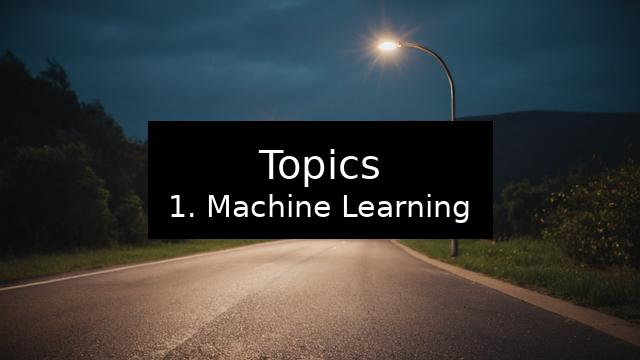
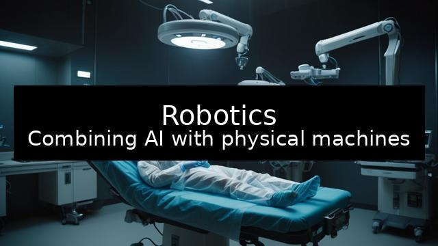
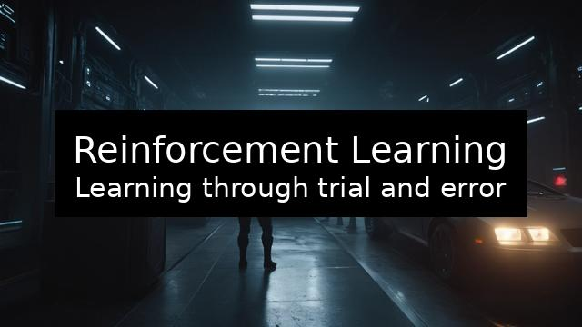

    # AI Technologies
    
    Exploring the tools and methods that drive intelligent systems

Artificial Intelligence (AI) technologies are revolutionizing industries and everyday life by enabling machines to learn, reason, and adapt like humans. From natural language processing to robotics, AI is reshaping how we work, communicate, and innovate. This course explores the core AI technologies, their functions, and their applications across sectors. You will learn about machine learning, deep learning, natural language processing, computer vision, robotics, and more. By the end, you will understand how these technologies interact and how they are shaping the future of society and business.

## Topics

1. Machine Learning
2. Deep Learning
3. Natural Language Processing
4. Computer Vision
5. Robotics
6. Reinforcement Learning
7. Intelligent Agents
8. Big Data and AI
9. AI in Real World Applications
10. Future of AI Technologies

## Machine Learning

	Teaching computers to learn from data

Machine learning (ML) is a subset of AI that allows systems to improve performance over time by learning from data. Instead of being explicitly programmed, ML models identify patterns and make predictions or decisions. Different approaches include supervised learning (using labeled data), unsupervised learning (finding hidden patterns), and reinforcement learning (trial-and-error learning with feedback). ML powers many applications, such as spam filters, recommendation systems, and fraud detection, making it one of the most widely used AI technologies.

**Key Ideas:**
1. **ML allows systems to learn from data**
2. **Supervised learning uses labeled examples**
3. **Unsupervised learning finds hidden patterns**
4. **Reinforcement learning improves through feedback**
5. **ML powers everyday applications like recommendations**

## Deep Learning

	Building powerful neural networks for complex tasks

Deep learning (DL) is a specialized subset of machine learning that uses artificial neural networks with multiple layers to model complex data. DL systems excel at tasks like image recognition, speech processing, and natural language understanding. They automatically extract features from raw data without manual intervention. Applications of DL include self-driving cars, facial recognition, and protein structure prediction. By mimicking the human brain’s layered approach to learning, DL enables machines to handle vast and complex datasets with high accuracy.

**Key Ideas:**
1. **DL uses multi-layered neural networks**
2. **It excels at recognizing complex patterns**
3. **Automates feature extraction from raw data**
4. **Used in self-driving cars and medical research**
5. **Inspired by the human brain’s processing**

## Natural Language Processing

	Enabling machines to understand human language

Natural Language Processing (NLP) is an AI field focused on enabling computers to understand, interpret, and respond to human language. It underpins technologies like chatbots, virtual assistants, translation tools, and sentiment analysis systems. NLP combines linguistics, computer science, and AI to process large amounts of text and speech data. By applying NLP, companies can automate customer service, analyze social media sentiment, and create more natural human-computer interactions. Its ability to bridge the gap between people and machines makes it vital to modern AI.

**Key Ideas:**
1. **NLP enables understanding of human language**
2. **It powers chatbots and translation tools**
3. **Combines linguistics with AI models**
4. **Helps analyze large amounts of text and speech**
5. **Improves human-computer interaction**

## Computer Vision

	Giving machines the ability to see and interpret images

Computer vision is the AI technology that allows computers to interpret and make decisions based on visual data. It is widely used in applications such as facial recognition, medical imaging, and autonomous vehicles. By analyzing images and videos, computer vision systems can detect objects, recognize patterns, and even track movements. Deep learning has greatly advanced this field, enabling real-time recognition and decision-making. This section explores how computer vision is transforming industries by automating and enhancing visual tasks.

**Key Ideas:**
1. **Computer vision processes images and videos**
2. **Used in facial recognition and self-driving cars**
3. **Enhances decision-making through visual data**
4. **Relies on deep learning for accuracy**
5. **Transforms industries like healthcare and security**

## Robotics

	Combining AI with physical machines

Robotics is the field that integrates AI into machines capable of interacting with the physical world. AI-powered robots can sense their environment, learn from experiences, and perform tasks autonomously or semi-autonomously. From industrial robots in factories to healthcare robots assisting in surgeries, robotics is transforming many sectors. By integrating AI, robots can adapt, plan, and act in dynamic environments, making them valuable tools for efficiency, safety, and precision.

**Key Ideas:**
1. **Robotics combines AI with physical machines**
2. **Robots can sense, plan, and act autonomously**
3. **Used in manufacturing, logistics, and healthcare**
4. **AI makes robots adaptable and intelligent**
5. **Improves efficiency and safety in industries**

## Reinforcement Learning

	Learning through trial and error

Reinforcement learning (RL) is a machine learning technique where an agent learns by interacting with its environment and receiving feedback through rewards or penalties. It is widely used in gaming, robotics, and autonomous systems. RL enables systems to optimize strategies and decision-making over time. A well-known example is DeepMind’s AlphaGo, which learned to master the complex game of Go. This approach mirrors human learning by emphasizing practice, feedback, and improvement.

**Key Ideas:**
1. **RL learns through trial and error**
2. **Feedback comes as rewards or penalties**
3. **Used in robotics and gaming**
4. **Optimizes strategies over time**
5. **Inspired by human learning processes**

## Intelligent Agents

	Autonomous systems that act on goals

Intelligent agents are entities that perceive their environment, make decisions, and act to achieve specific goals. They can be software-based, like digital assistants, or hardware-based, like robots. Intelligent agents adapt to new information, learn from interactions, and often use AI techniques such as machine learning. Examples include recommendation systems, autonomous drones, and personal assistants like Siri. Their adaptability and autonomy make them crucial in creating flexible and responsive AI applications.

**Key Ideas:**
1. **Intelligent agents perceive and act autonomously**
2. **They adapt and learn from their environment**
3. **Exist as software or hardware entities**
4. **Used in assistants, drones, and recommendations**
5. **Enable flexible AI applications**

## Big Data and AI

	Powering AI with massive datasets

Big Data refers to extremely large and complex datasets that traditional methods cannot process effectively. AI technologies thrive on Big Data, as more data enables more accurate predictions and decisions. Machine learning, deep learning, and NLP all require massive datasets to train models. From social media analytics to healthcare research, Big Data fuels AI’s effectiveness. This section highlights how AI and Big Data are interconnected and why data is the backbone of intelligent systems.

**Key Ideas:**
1. **Big Data consists of massive datasets**
2. **AI technologies rely on data for learning**
3. **More data improves prediction accuracy**
4. **Used in social media, healthcare, and finance**
5. **Big Data is the backbone of modern AI**

## AI in Real World Applications

	Transforming industries and society

AI technologies are applied in numerous fields, from healthcare and education to transportation and entertainment. In medicine, AI assists with diagnosis and drug discovery. In business, it improves customer service and automates operations. In smart cities, AI optimizes energy use and traffic management. This section explores how different sectors leverage AI to improve efficiency, innovation, and human experiences, demonstrating the transformative power of AI across industries.

**Key Ideas:**
1. **AI is applied across industries**
2. **Healthcare uses AI for diagnosis and research**
3. **Education benefits from AI tutors and tools**
4. **Smart cities improve efficiency with AI**
5. **Applications show AI’s wide impact**

## Future of AI Technologies

	Adapting to the evolving landscape

The future of AI technologies is shaped by rapid innovation, ethical challenges, and growing societal impact. Trends include the rise of explainable AI, integration of AI with emerging technologies like blockchain and IoT, and increasing focus on ethical use. AI will continue to revolutionize industries but must also address concerns such as privacy, bias, and job displacement. This section looks ahead at how AI will evolve and what challenges and opportunities lie ahead.

**Key Ideas:**
1. **Explainable AI improves trust in systems**
2. **AI integrates with IoT and blockchain**
3. **Ethical concerns must be addressed**
4. **Job roles will evolve with AI adoption**
5. **Future AI will shape industries and society**

## Conclusion

AI technologies represent the building blocks of intelligent systems that are transforming our world. From machine learning to robotics, each technology brings unique capabilities that, when combined, create powerful applications. By understanding these technologies, we gain insight into how AI functions and its potential to drive change. Organizations and individuals who embrace AI technologies responsibly will be better prepared to thrive in a future shaped by intelligent systems.

## Next Steps

- Explore AI development tools and frameworks  
- Engage in discussions about AI ethics and applications  
- Apply knowledge to design AI-driven projects  

## Slides

  

    
  

  

    
  

  

    
  

  

    
  

  

    
  

  

    
  

  

    
  

  

    
  

  

    
  

  

    
  

  

    
  

  

    
  

  

    
  

## Swiper Slides

<!-- Swiper slider -->
<link rel="stylesheet" href="https://unpkg.com/swiper/swiper-bundle.min.css" />

  

    

      

        <h2 style="color: #fff;">Topics</h2>
        
1. Machine Learning

      

    

    

      

        <h2 style="color: #fff;">Machine Learning</h2>
        
Teaching computers to learn from data

      

    

    

      

        <h2 style="color: #fff;">Deep Learning</h2>
        
Building powerful neural networks for complex tasks

      

    

    

      

        <h2 style="color: #fff;">Natural Language Processing</h2>
        
Enabling machines to understand human language

      

    

    

      

        <h2 style="color: #fff;">Computer Vision</h2>
        
Giving machines the ability to see and interpret images

      

    

    

      

        <h2 style="color: #fff;">Robotics</h2>
        
Combining AI with physical machines

      

    

    

      

        <h2 style="color: #fff;">Reinforcement Learning</h2>
        
Learning through trial and error

      

    

    

      

        <h2 style="color: #fff;">Intelligent Agents</h2>
        
Autonomous systems that act on goals

      

    

    

      

        <h2 style="color: #fff;">Big Data and AI</h2>
        
Powering AI with massive datasets

      

    

    

      

        <h2 style="color: #fff;">AI in Real World Applications</h2>
        
Transforming industries and society

      

    

    

      

        <h2 style="color: #fff;">Future of AI Technologies</h2>
        
Adapting to the evolving landscape

      

    

    

      

        <h2 style="color: #fff;">Conclusion</h2>
        
AI technologies represent the building blocks of intelligent systems that are transforming our world. From machine learning to robotics, each technology brings unique capabilities that, when combined, create powerful applications. By understanding these technologies, we gain insight into how AI functions and its potential to drive change. Organizations and individuals who embrace AI technologies responsibly will be better prepared to thrive in a future shaped by intelligent systems.

      

    

    

      

        <h2 style="color: #fff;">Next Steps</h2>
        
- Explore AI development tools and frameworks

      

    

  

  <!-- Add Pagination -->
  

  <!-- Add Navigation -->
  

  

